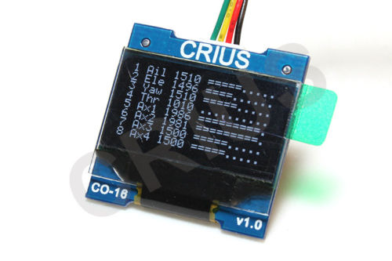

libsdisp
============

a c library with abstraction for small displays

about
-------------------------
TODO

supported displays
-------------------------
  * Crius-OLED 
    * you probably need to fix the hardware: http://forum.arduino.cc/index.php?topic=159851.45
  * Generic SSD1327 - not tested
  * Generic SSD1307 - not testet

install
-------------------------
All you need is cmake and a gcc. Then simply create makefiles with cmake and feel free to compile:

<pre>
git clone https://github.com/erazor83/libsdisp
cd libsdisp
cmake .
make
make install
</pre>

There are some options to enable different additional features:
  * WITH_SHARED - build shared .so file (libsdisp_shared.so)
  * WITH_EXAMPLES - build examples
  * WITH_SWIG_PYTHON - build python lib
  

<pre>
cmake -DWITH_SHARED=1 .
</pre>

There is even a libsdisp ebuild at http://wiki.erazor-zone.de/wiki:projects:linux:gentoo

For python you should probably also define your desired python target like this:
<pre>
cmake -D WITH_SHARED=1 -D WITH_EXAMPLES=1 -D WITH_SWIG_PYTHON=1 -DPYTHON_INCLUDE_DIR=$(echo /usr/include/python2*) -DPYTHON_LIBRARY=$(echo /usr/lib/libpython2.*.so) .
</pre>

license
-------------------------
GNU General Public License, version 2

credits
-------------------------
  
links
-------------------------
  
